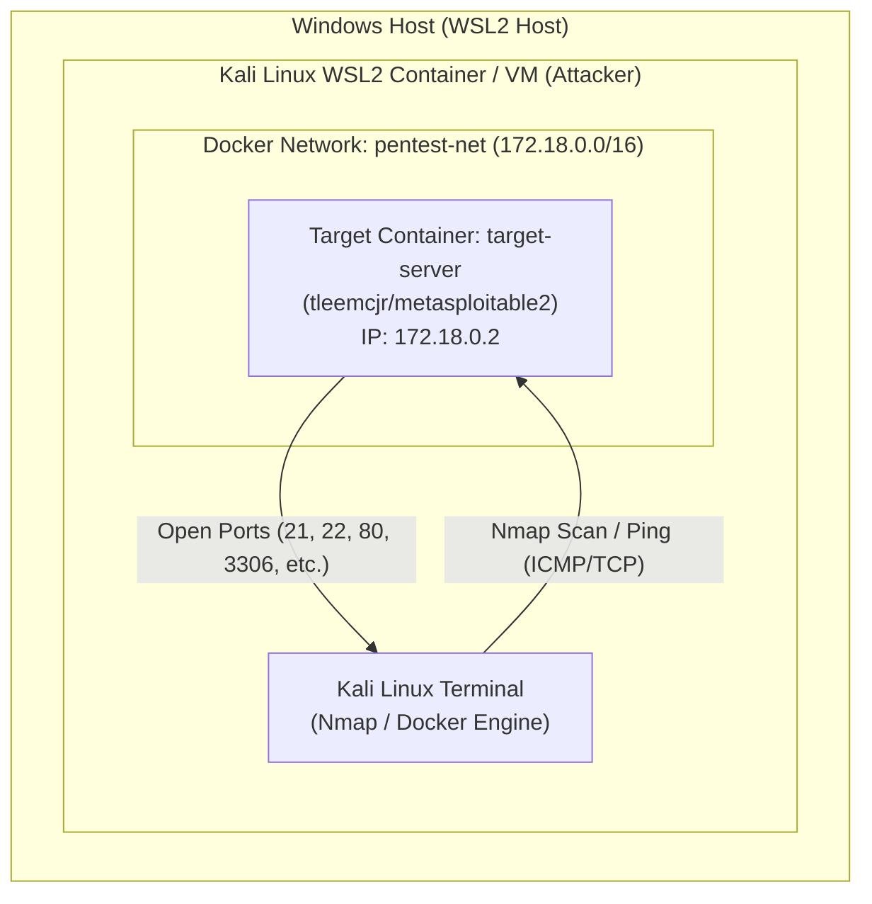

# Local Nmap Scanning & Pentesting Lab Setup (WSL2 + Docker)

This repository details the configuration steps to set up a sandboxed penetration testing lab on a Windows host using Windows Subsystem for Linux (WSL 2) running Kali Linux as the attacking machine and Docker to host the target: Metasploitable2.

Using a dedicated Docker bridge network (`pentest-net`), we ensure the vulnerable target container is isolated from the Windows host while remaining fully accessible to the Kali Linux tools.

## Prerequisites

- Windows 10/11 with WSL 2 enabled.
- Kali Linux WSL instance installed.
- Sudo/Root privileges within Kali Linux.

---
## Lab Setup Procedure


### Architecture Diagram
This diagram visualizes how the physical Windows host connects to the virtualized Kali WSL2 environment and how Kali communicates with the target Metasploitable2 container via the private pentest-net Docker bridge.

## Lab Architecture



Follow these steps within your Kali Linux terminal to provision the lab.

### Step 1: Install and Initialize Docker in WSL 2

Update your Kali package index and install Docker, alongside Nmap for the attacking toolset. Ensure the Docker daemon is running.

```bash
# Update Kali package index and install required tools
sudo apt update && sudo apt install -y docker.io nmap

# Start the Docker daemon
sudo service docker start
```

### Step 2: Create an Isolated Docker Pentest Network
To prevent isolation issues common in complex WSL networks, create an explicit, dedicated Docker bridge network called pentest-net. This provides a stable internal subnet for both Kali and the target.

``` bash
┌──(thamizh㉿LAPTOP-RREKKFPQ)-[/mnt/c/windows/system32]
└─$ sudo docker network create --driver bridge pentest-net
# Output (Network ID):
674ad9eb94738bf765ed7ad29923d78d7f4fe76f4b8520de071c4e282e0a797c
```

### Step 3: Launch the Vulnerable Target Container
Launch the Metasploitable2 container (using the tleemcjr/metasploitable2 image). We use Interactive TTY mode (-itd) to keep the services alive and attach it to our custom pentest-net.

```bash
┌──(thamizh㉿LAPTOP-RREKKFPQ)-[/mnt/c/windows/system32]
└─$ sudo docker run -itd --name target-server --network pentest-net tleemcjr/metasploitable2
# Output (Container ID):
1b5baa8c6577964315a613d40a53c289b0b93602b364082ce30a40236895c3e7
```

### Lab Verification & Basic Scanning
Once provisioned, verify the target is active and routeable.

### Step 4: Verify Services Running Inside the Container
Inspect the container's internal processes to confirm that vulnerable services (Apache, FTP, MySQL, SSH, etc.) initialized successfully.
```bash
┌──(thamizh㉿LAPTOP-RREKKFPQ)-[/mnt/c/windows/system32]
└─$ sudo docker exec -it target-server ps aux
# Expected Output Snippet (Verify Active Processes):
# USER       PID COMMAND
# www-data    44 /usr/sbin/apache2 -k start
# mysql      227 /usr/sbin/mysqld ...
# root       560 postgres: postgres postgres [local] SELECT
# ...
```

### Step 5: Extract Target IP and Run Nmap
Inspect the target-server container to find its dynamically assigned IP address within the pentest-net subnet.

```bash
┌──(thamizh㉿LAPTOP-RREKKFPQ)-[/mnt/c/windows/system32]
└─$ sudo docker inspect -f '{{range .NetworkSettings.Networks}}{{.IPAddress}}{{end}}' target-server
# Output Example:
172.18.0.2
```

Run Nmap (Fast Scan -F) from the Kali terminal against the extracted Docker IP:

```bash
┌──(thamizh㉿LAPTOP-RREKKFPQ)-[/mnt/c/windows/system32]
└─$ nmap -F 172.18.0.2
Starting Nmap 7.99 ( [https://nmap.org](https://nmap.org) ) at 2026-10-04 16:09 +0530
Nmap scan report for 172.18.0.2
Host is up (0.000047s latency).
Not shown: 84 closed tcp ports (reset)
PORT     STATE SERVICE
21/tcp   open  ftp
22/tcp   open  ssh
23/tcp   open  telnet
25/tcp   open  smtp
80/tcp   open  http
111/tcp  open  rpcbind
139/tcp  open  netbios-ssn
445/tcp  open  microsoft-ds
513/tcp  open  login
514/tcp  open  shell
2121/tcp open  ccproxy-ftp
3306/tcp open  mysql
5432/tcp open  postgresql
5900/tcp open  vnc
6000/tcp open  X11
8009/tcp open  ajp13
MAC Address: 32:FE:44:A4:8F:9B (Unknown)

Nmap done: 1 IP address (1 host up) scanned in 0.79 seconds
```

### Step 6: Verify Network Routeability (Ping)
Ensure the Docker bridge adapter in Kali is successfully routing traffic to the target container.

```bash
┌──(thamizh㉿LAPTOP-RREKKFPQ)-[/mnt/c/windows/system32]
└─$ ping -c 3 172.18.0.2
PING 172.18.0.2 (172.18.0.2) 56(84) bytes of data.
64 bytes from 172.18.0.2: icmp_seq=1 ttl=64 time=1.51 ms
64 bytes from 172.18.0.2: icmp_seq=2 ttl=64 time=0.784 ms
64 bytes from 172.18.0.2: icmp_seq=3 ttl=64 time=0.257 ms

--- 172.18.0.2 ping statistics ---
3 packets transmitted, 3 received, 0% packet loss, time 2003ms
rtt min/avg/max/mdev = 0.257/0.851/1.512/0.514 ms
```
